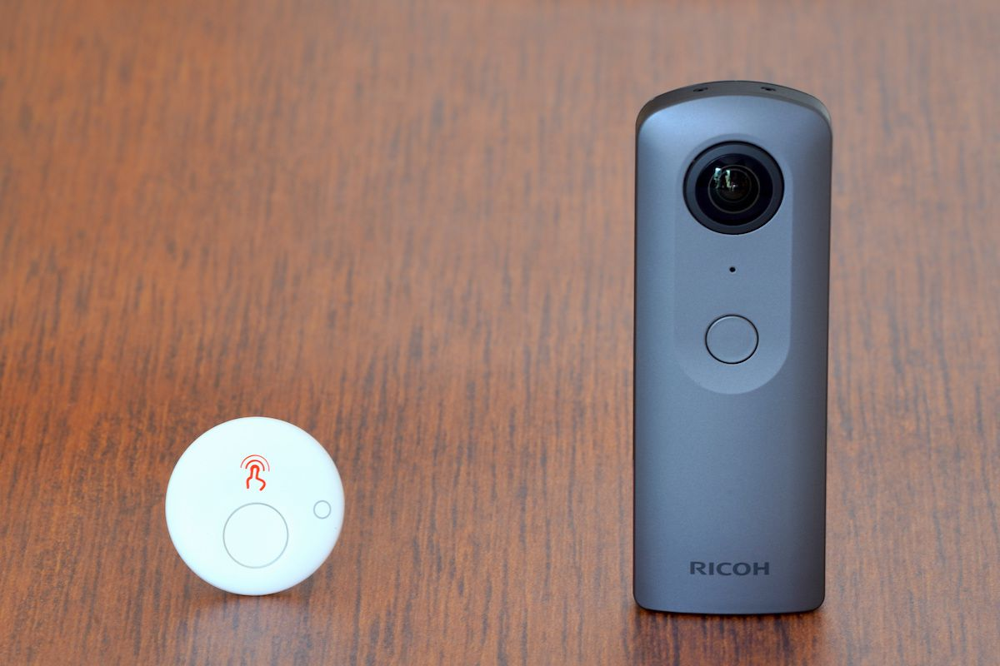
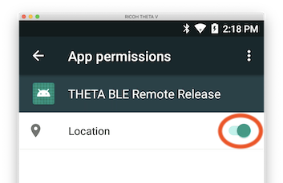
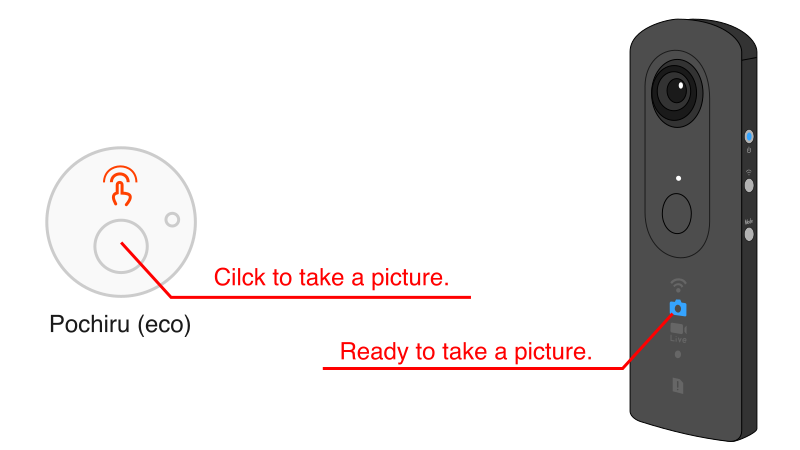

# THETA Plug-in BLE Remote Release

This sample plug-in detects BLE advertising from [Pochiru (eco)](http://www.products.braveridge.com/pochiru_eco/) and shoots pictures.



## Set up

1. Download this project using git close.
    ```sh
    $ git clone https://github.com/theta-skunkworks/theta-plugin-ble-remote-release
    ```
2. Import this project by Android Studio.
3. Build the plug-in and install to the THETA.
4. Set up app permissions manually after the installation using by ADB command or Vysor.
    ```sh
    $ adb shell pm grant skunkworks.bleremoterelease android.permission.ACCESS_COARSE_LOCATION
    ```
    

## How to Use Plug-in

1. Start the plug-in.
2. Ready to take a picture if the Camera LED () is turned on.
3. Click the button of Pochiru (eco) to take a picture.
4. Wait a several seconds to take next picture. Camera LED will turn on again.



## License

```
Copyright 2019 Ricoh Company, Ltd.

Licensed under the Apache License, Version 2.0 (the "License");
you may not use this file except in compliance with the License.
You may obtain a copy of the License at

    http://www.apache.org/licenses/LICENSE-2.0

Unless required by applicable law or agreed to in writing, software
distributed under the License is distributed on an "AS IS" BASIS,
WITHOUT WARRANTIES OR CONDITIONS OF ANY KIND, either express or implied.
See the License for the specific language governing permissions and
limitations under the License.
```
